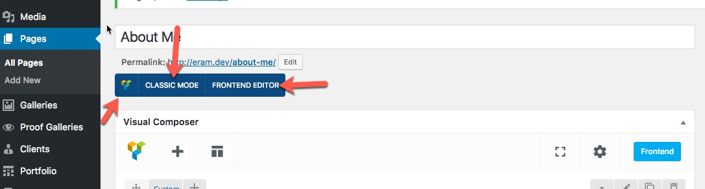
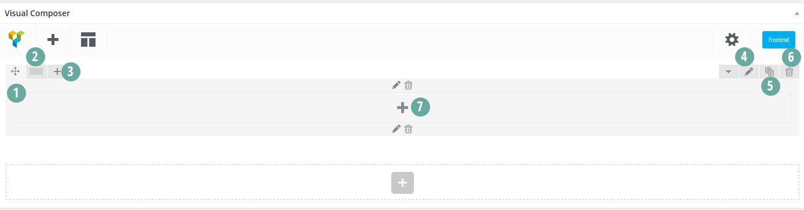
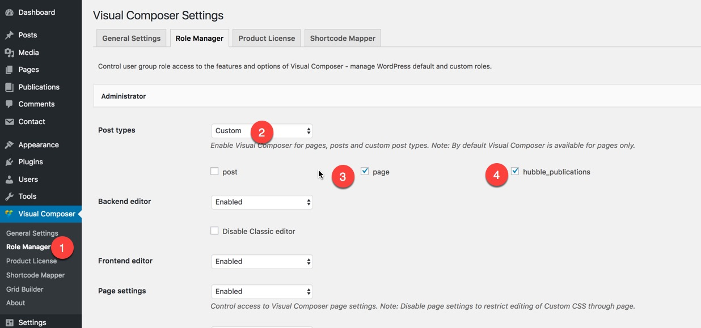

# Pages

## Pages

Majority of pages you see in the demo are easily built using visual composer. Hubble theme adds some more useful content elements \( shortcodes \) to visual composer elements lists which you can explore and use which one you need.

## Visual Composer

Now that we are familiar with different available page templates, it's time to jump in and create pages using our page builder. We are using Visual Composer page builder in Eram. Our focus on this section is on basic usage pf Visual Composer and elements and options that we have added to Visual Composer.

If you have installed and activate the Visual Composer you will see it's editor when you are creating/editing a page. It has two mode of editing and you can edit the content of page either from backend or frontpage. The benefit of frontpage mode is that you can also see the generated output in same page that you are making edits.

Visual Composer has a responsive 12 column grid based on bootstrap. You can add rows and different column sizes and change the layout. Let's take a look in to available options. Here is what you will see after adding a row element:

1. Move the row in page
2. Change the columns number
3. Add column to row
4. Edit row
5. Duplicate row
6. Delete row
7. Add element to column

### Should I purchase a licnece or activate my visual composer plugin?

Generally you don't need to purchase any license for it or you don't need to activate it. We have purchased a license that allows us to distribute the Visual Composer bundeled with our theme. Everytime the plugins gets updated, out team will look into it, make the theme compatible with the changes and will update the theme including new updated plugin. So, all you should do is to wait for us to release a new version.

### How to activate the Visual Composer for posts and publications?

As an administrator, you should go to Visual Composer settings &gt; Role Management and you can define which user groups can use the visual composer on which post types.

