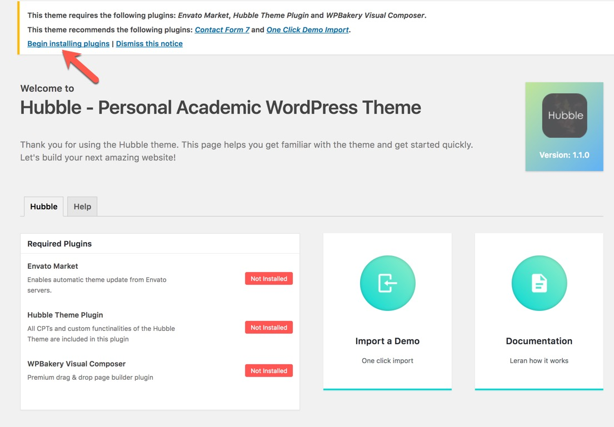
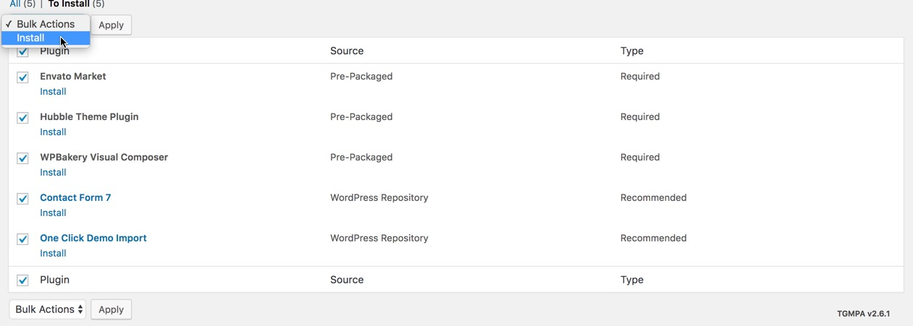

# Plugins Installation

When you activate the theme you will be redirected to a welcome screen where you can find some information about theme installations and status of required plugins along with the help and link to documentations and support center.

**Click on Begin installing plugins**

And install and activate all plugins:

The most important one is the **Hubble Theme Plugin.** 

The **WPBakery Visual Composer** plugin is essential to build pages of the theme.

The **Envato Market** will help you update your theme automatically.

