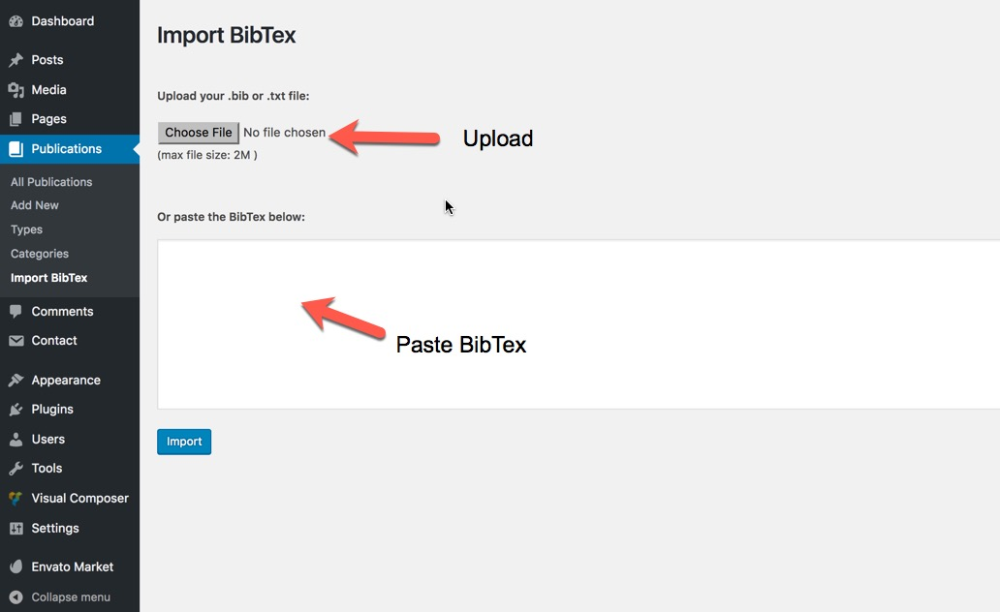

# Publications

Your publications might be the most important part of your website. Hubble theme comes with a nice list of publications with built in search and filter. Also you can organize your publications to by their type \( i.e. Journal Article, Conference, Book, etc\) and also categorize them.

## BibTex Importer

You can import a list using the BibTex importer right away and then add some more information like abstract and image and build a complete page for each of your publications to give more information on your paper or book.

You can find the importer under Publications menu.

Copy and paste the BibTex or upload a txt or bib file and you are fine.

### Publication ordering

Since v1.3 there is an option to change the ordering of the publications.

* Go to Admin &gt; Appearance &gt; Customize to load the customizer.
* Scroll down the sidebar and click on Publications Settings
* Go to Ordering section.

### Make BibteX available for visitors

Since v1.3 there is an option to make BibTeX visible for visitors.

* Go to Admin &gt; Appearance &gt; Customize to load the customizer.
* Scroll down the sidebar and click on Publications Settings
* Go to Archive Settings section.

This will also shows the BibteX popup link in the single\(details\) page.

