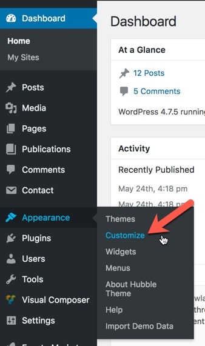
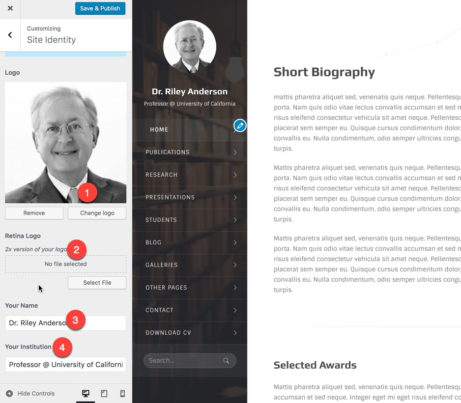
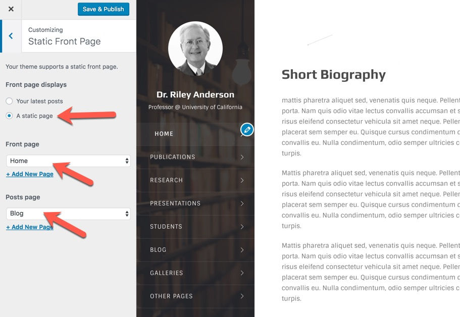
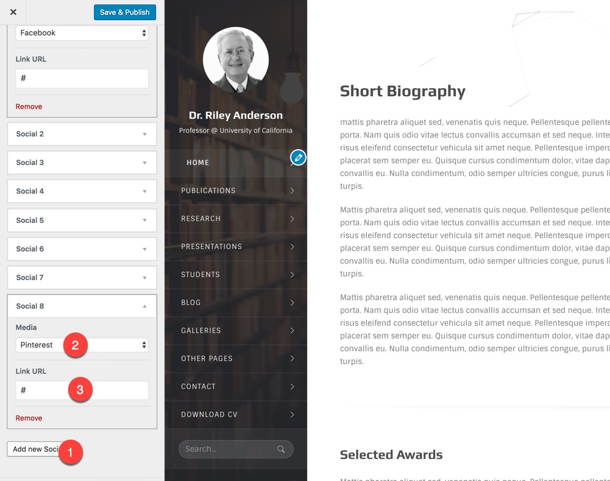
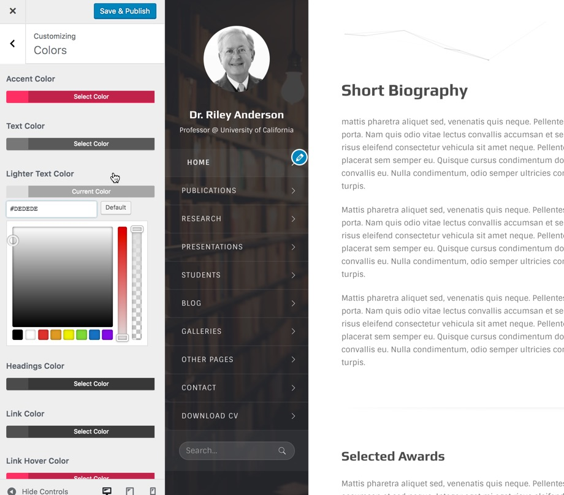
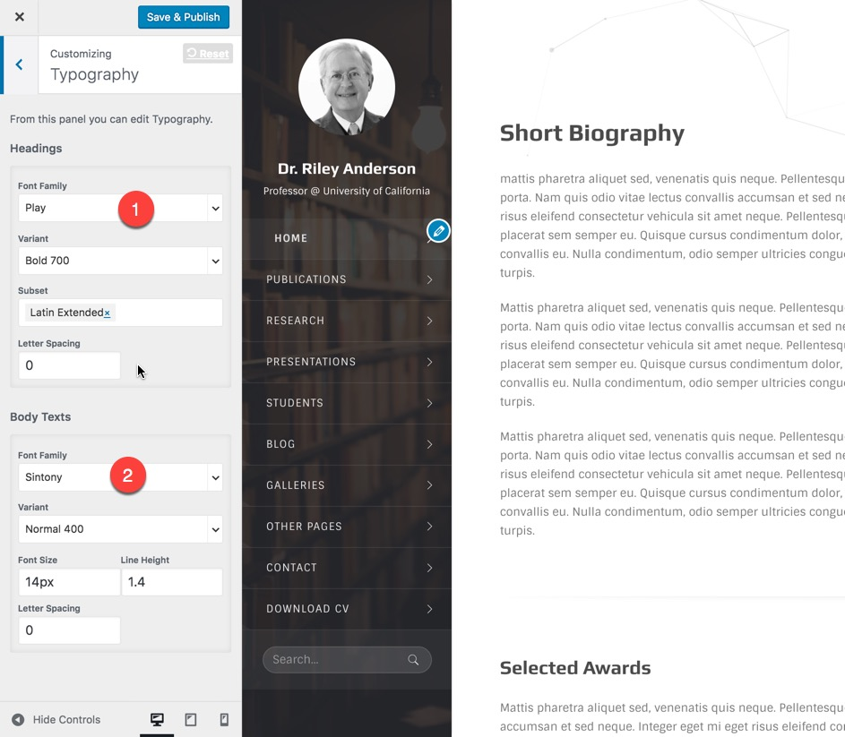

# Theme Options

All options and customizations offered by the Hubble theme are available at WordPress Customizer which is placed at Dashboard&gt;_Appearance &gt; Customize_ menu. Theme specific settings are available in _Theme settings_ section.

## Logo and Website Identity

1. Logo or your personal photo. Note that you should upload a **square photo** or logo there.
2. Retina Logo which will be replaced by the logo when visitors use a retina deisplay device like.
3. The name that will be displayed under the logo
4. The title that will be displayed under the logo

### Static Front page

By default WordPress shows recent posts in homepage and also has the capability of setting a static page as homepage.

You may want to set a page as your homepage rather than you posts list. This can be done in Dashboard-&gt;appearance-&gt;Customize-&gt;Static Front Page :

### Social Icons

From _Customizer &gt; Theme Settings &gt; Social icons_ you can add as many social icons as you want.

1. Add new item
2. Select the social media from the dropdown 
3. Insert your Profile Url
4. Repeat this for other icons

### Coloring Options

## Typography

You can choose from various[ **google fonts**](http://fonts.google.com/) for the headings and the body texts of your theme.

## Additional Sidebars

You may need to have additional sidebars. Sidebar is a widget container that you can add some widgets to it using admin panel and then place it where possible at the blog sidebar or inside your pages using the visual composer.

